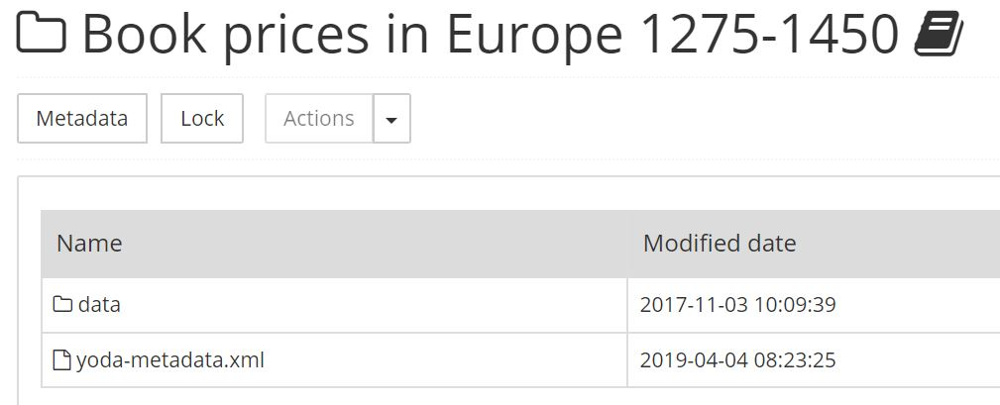
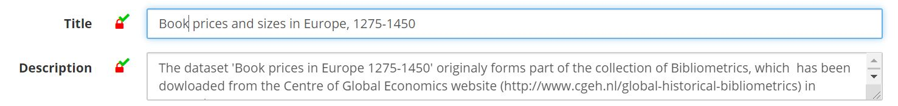
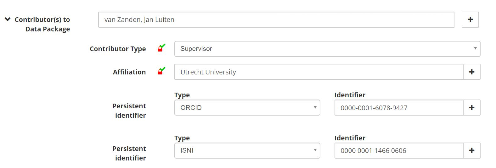

# Adding and reusing metadata

## Metadata in Yoda

Metadata is &ldquo;data about data&rdquo;. Metadata serves multiple purposes in Yoda, the most important being:

- To describe the contents of a dataset for a broad audience.
- To inform the audience whether the data can be reused and if so, under what conditions.
- To prescribe how the data should be cited and whom to acknowledge.
- To inform digital archivists and IT staff about how long the data should be retained.
- To facilitate finding the dataset in data catalogues.

We distinguish two types of metadata:

**Structured metadata** consists of information that is standardized globally and used by data catalogs.
Examples are the name of the data package, its creator, the retention period of the package, etc.

When a data package is published, Yoda makes the structured metadata available for harvesting by data catalogs.

**Unstructured metadata** is intended to provide more detailed information about the data. This information can be in a README.TXT or other file
that is included as part of the data package. The format of this file is chosen by the researcher. Users will need to open and inspect the
data package to find this metadata. Unstructured metadata can include information about (for example) the experimental design, data transformation, sampling method, etc.

## Adding metadata in Yoda

Yoda facilitates adding both structured and unstructured metadata to your research data. Entering structured metadata is a prerequisite for archiving a data package.
If a folder is published, its structured metadata will be published as well and can be harvested by data catalogs such as
[DANS NARCIS](https://www.narcis.nl/?Language=nl    ) and [DataCite](https://search.datacite.org/).

In order to add structured metadata to a folder, navigate to the folder in the Yoda portal and press the &ldquo;Metadata&rdquo; button.

Once you have added metadata and clicked on the &ldquo;Save&rdquo; button, the metadata will be stored in a specific format in the folder. Yoda uses files
named &ldquo;yoda-metadata.xml&rdquo; for this purpose.

Unstructured metadata can be added as a file to the dataset, for example in a &ldquo;Readme.txt&rdquo; or &ldquo;Codebook.pdf&rdquo; file.

## The metadata form

By default, the Yoda metadata form consists of approximately 30 fields. Data managers can optionally customize the metadata form of a community.
Please consult the [metadata element list](metadata-details.html) for a detailed description of the elements.

All mandatory fields are marked with a padlock icon.

Some metadata elements consist of multiple fields. For example, if you enter a person identifier, you should also specify the type of identifier.

Some fields can have multiple values. In order to add a value, press the &ldquo;+&rdquo; sign next to the field.

## Reusing metadata

Structured metadata is reusable. The metadata form includes a button &ldquo;Clone from parent folder&rdquo;. One way to use this feature is to create
a project-level folder with several subfolders for data. Common metadata elements for the project can be entered in the project-level folder. This
metadata can then be copied to the data folders.

You can also copy the &ldquo;yoda-metadata.xml&rdquo; file of a folder to another folder in order to copy its metadata.
