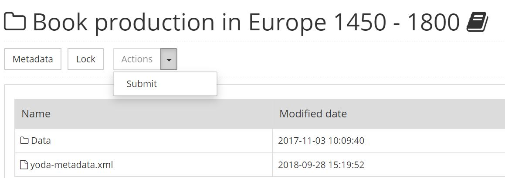

# Archiving data
If you choose to archive a part of the data in your data compartment, Yoda will create a snapshot of this data.
This snapshot is copied to the archive (also known as &ldquo;Vault&rdquo;) of your data compartment,
where it will be retained unchanged during its retention period.

After archiving your data, you can optionally [publish it](Publishing.html), thus making your data findable. If
you classify your data as **open - freely retrievable**, then the data itself can be downloaded anonymously by
any third party.

This page contains information about how to create a data package, how to submit a data package to the vault,
how the data package will be evaluated after submission, and how to manage archived data packages.

## Creating a data package

The data in your research data compartment is a set of files and folders.

If part of this data is to be archived, it is important that it has a logical folder structure, that
it has appropriate metadata, and that it contains documentation which describes the data in more detail (such as
a readme.txt file or codebook files). This ensures that other researchers will be able to understand
the semantics of the data, the way in which it was collected or generated, and the conditions for (re)use.

## Submitting a data package to the Vault

In order to submit a data package to the vault, you need to be either a group manager or a regular member of the
group that contains the data.

First, navigate to the folder you want to archive in the Yoda portal. Ensure that you are  **in** the folder which
you want to submit to the vault. Check that all mandatory metadata has been entered in
[the metadata form of the folder](Add-metadata.html).

Now press the &ldquo;Actions (Submit)&rdquo; button. 

If any metadata is missing, the system will tell you what metadata still needs to be entered.
If all required metadata is present, the system will lock the folder and its subfolders during the archiving process. This ensures that data in the
folder can no longer be changed. Once the system has copied all data to the vault, the lock will be removed
automatically.

The data manager will then assess the data package.

## Data manager assessment

The data manager will check that the data package is self-evident for other researchers, and
will check for compliance with privacy rules and regulations.  For additional information,
please consult the [Data Curation checklist](checklist_YODA_V5p.pdf).

The data manager can either approve the data package for archiving or suggest improvements.

## Managing archived data packages

The vault of your group becomes visible in the Yoda portal once it contains at least one data package. Everyone with access
to your group research folder also has read-only access to the vault of your group.

If the research folder has been deleted, you can request access to the archived data package via the data manager. If the data package
has been published as  _Open - Freely retrievable_, it can be retrieved via data catalogs such as [Dans Narcis](https://www.narcis.nl/?Language=nl)
and [DataCite](https://search.datacite.org/).

## Curation of data packages

Yoda preserves your files in their original state. If you want to have the files in your data package converted
to newer file formats as they become available, please contact the data manager to make such arrangements.
Curation may involve significant costs to the faculty or research program due to involvement of third party experts
that know how to transform specific formats.

A best practice to avoid high curation costs is to store your data in open formats. DANS maintains a
[list of open file formats](https://dans.knaw.nl/en/about/services/easy/information-about-depositing-data/before-depositing/file-formats).
If using only open file formats is not feasible, consider exporting each file in a vendor-specific format to an open file format,
and storing the exported open format version along with the vendor-specific format version.
