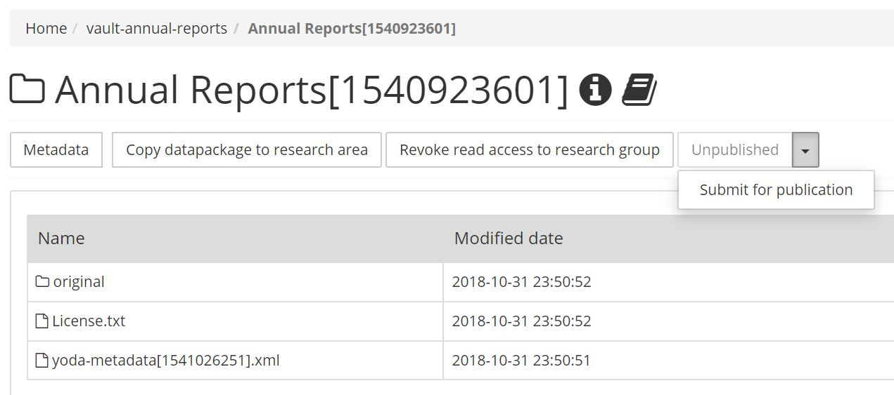
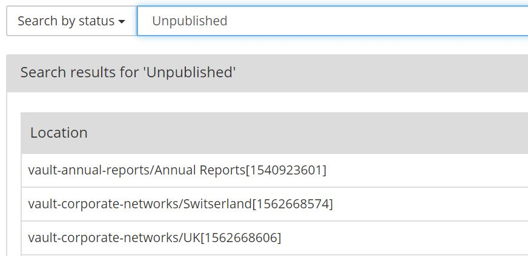

# Publishing a data package

After a data package has been archived in the vault, it can optionally be submitted for publication.

Publishing a data package has the following effects:

- A [DOI](https://www.doi.org/) will be assigned to the data package. This persistent identifier can be used to refer to the data package, e.g. in a scientific publication.
- The metadata of the data package will be published in data catalogs such as [Dans NARCIS](https://www.narcis.nl/?Language=nl) and [DataCite](https://search.datacite.org/).
- If the Access Type metadata field is set to &ldquo;Open - Freely retrievable&rdquo;, the data in the data package will be published as well. If the Access Type metadata field is set to &ldquo;Restricted&rdquo; or &ldquo;Closed&rdquo;, the data in the data package won't be published.

To submit a data package for publication, navigate to the data package in the vault and press the &ldquo;Publish&rdquo; button.

You can search for data that is archived but not (yet) published using the &ldquo;Search by Status&rdquo; function in the Yoda Portal.
The list of data packages will include only the data packages in data compartments of which you are a member.
Click on a data package in the results list in order to view it.

Once you’ve submitted a data package for publication, the data manager of your Yoda community will be notified. He or
she will check that the data package meets various criteria for publication, such as:
- The data package has a valid license type.
- The access type of the data package is consistent with laws and regulations, including information privacy laws.

If the data manager encounters any issues, he or she will contact you. Otherwise you'll receive an email notification that your data package has been
published. This notification contains the DOI that has been assigned to your data package.
