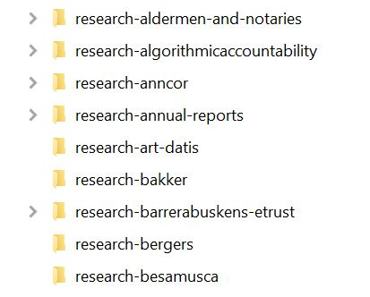

# Storing your data in Yoda

Once you have connected the [Yoda Network Disk](../getting-started/index.md) you have access to Yoda  storage. Depending on your operating system, this could be via your File Explorer (Windows), Finder (Mac) or any other client program, like [CyberDuck](https://cyberduck.io/) or [WinSCP](https://winscp.net/eng/docs/lang:nl).

You will only have access to the user-groups for which you have been registered.  

Depending on your rights, you can add, rename and delete files and folders.

The Yoda Portal does not yet allow for up- and downloading files. This functionality is expected early 2020.

