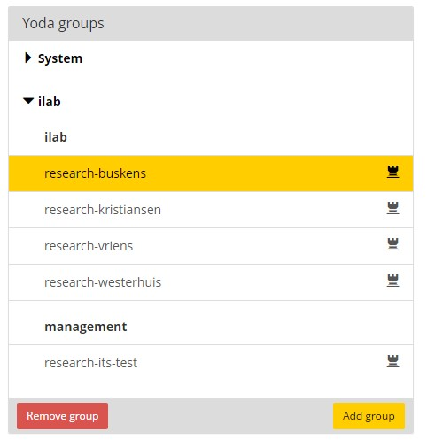

# Collaborate, manage user access

All the data you save on Yoda is stored in compartments accessible only by members of a Yoda group. 
Top-level folders starting with the prefix 'research-' delimit a data compartment. The folder is named after the Yoda group.
All the files and folders underneath this top-level folder are visible and accessible only to the group.

The Yoda data manager can create additional compartments should you need to collaborate with a different set of researchers.  
To be able to do this yourselves, please also contact the Yoda data manager. 

Some general remarks on Yoda groups:

- There are three possible roles for a user: manager, researcher and reader.
  - Manager: add/remove users, grant/revoke user rights, and all rights related to the role Researcher.
  - Researcher: read/write/delete files and folders, submit to vault, publish.
  - Reader: read files.
- Groups can only be created/removed in the Yoda Portal.
- Once created, a group cannot be renamed.

## How to create a Yoda group

There are two prerequisites before you can create a new group:
- you need to be a Manager in another, existing group (within the same community)
- you need to have been granted a system-wide right to create groups  

To create a new group, navigate to the Yoda portal, log on and select Group Manager in the top-menu. Then:

- In the left pane of the Group Manager, titled Yoda Groups, select any existing group and press Add Group.
- A dialog starts to help you through the procedure:
  - Please note that only lowercase names are allowed. You can freely choose the name for the group, which will automatically be pre-fixed by 'research-'. .

## How to add/remove users (employees/students) to a Yoda group

You need to have Manager rights within the group to add or remove users.

To add/remove a user, select Group Manager in the top-level menu of the Yoda Portal

- In the left side of the page, select the group you want to add or remove users
- The right side of the page will display a list of all users that are member of the group

- To add a user: click on the text "Click here..." to add a new user to this group 
- Fill out the Utrecht University solis-email address of the user you want to add and press add user. The address must be entered entirely in lower case.
- To remove a user: select the user you want to remove and click the button "Remove User"

## How to add an external person to a group

Follow the same procedure as for procedure described in the previous section. However, instead of a  solis-mail address you fill out the person's organizational or private mail-address. He/she will be notified by email that an account has been created and be asked to set a password.
You, the host, will receive two email notifications: one to confirm the invitation and one when the user has set a password and therefore can access Yoda.

## Change access rights for group-members

Within a group a user can have either one of the following rights

- Read – represented by an icon depicting an eye

- Read/write – represented by an icon depicting a persons head

- Manage – represented by an icon a medieval tower

To change the rights of user:

- Navigate to the Group Manager in the Yoda Portal

- In the left side of the page, click/select the group
- In the right side of the page, a list of the users is displayed
- Select the user and press one of the buttons next to Change Role. 
The button with the up-arrow will grant more encompassing rights, the button with the down-arrow will downgrade rights.

