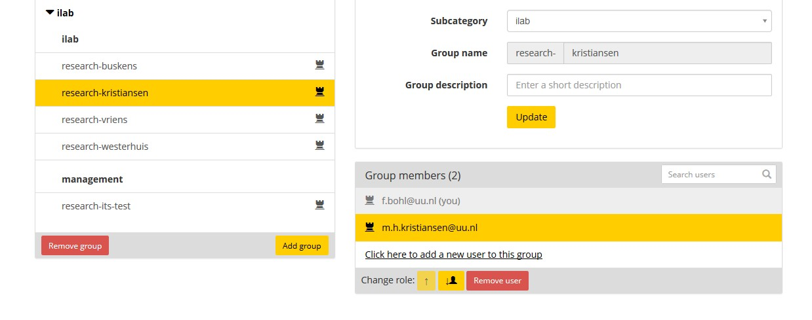
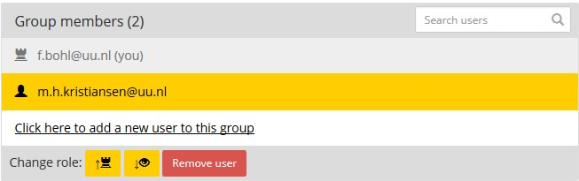

# Managing groups, users and access rights

All data in Yoda is stored in data compartments. Each data compartment has a top-level folder for research data.
The name of such a research folder, also known as a research group, always starts with &ldquo;research-&rdquo;.
Files in a research group are only visible and accessible to users who have been granted access to that group.

Users can have three different roles in a group:
- Member with read-only access: is able to view or download files in the group.
- Regular member: can view, download, upload, modify or delete files and folders in the group.
- Group manager: is able to grant and revoke access rights for the group. Can also view, download, upload, modify
  or delete files and folders in the group.

## Granting access to a group

If you are the group manager of a group, you will be able to add users to the group in the following way:
- Navigate to the [Yoda portal](../getting-started/getting-started-portal.html).
- Log in
- Select &ldquo;Group Manager&rdquo; in the top menu.
- In the left pane of the Group Manager, select the group
- Click on the link &ldquo;Click here to add a new user to the group&rdquo;.
- Enter the email address of the user. The address must be entered entirely in lower case.

A student or employee with an Utrecht University email address will be able to log in using his or her email address and
Solis password. Users with an external email address will receive an invitation link that can be used to create an account.
In this case, you (the host) will receive two email notifications: one to confirm the invitation and one to confirm that the user has
registered his or her account.

By default, a new user will be a regular member of the group. If you want the user to be a member with read-only access or
a group manager, see below for how to change users' roles.

## Changing the role of a user in a group

If you are the group manager of a group, you will be able to alter the role of other members.

Users can have three different roles in a group:
- Member with read-only access: is able to view or download files in the group.
- Regular member: can view, download, upload, modify or delete files and folders in the group.
- Group manager: is able to grant and revoke access rights for the group. Can also view, download, upload, modify
  or delete files and folders in the group.

In order to change the role of a group member:
- Navigate to the [Yoda portal](../getting-started/getting-started-portal.html).
- Log in
- Select &ldquo;Group Manager&rdquo; in the top menu.
- In the left pane of the Group Manager, select the group.
- In the right pane of the Group Manager, select the user.
- Press one of the buttons next to the &ldquo;Change role&rdquo; label to change the user's role.
  The button with the upward pointing arrow will grant a role with more rights, whereas the button
  with the downward pointing arrow will grant a role with fewer rights. The meaning of the icons is:
   * Crenellated tower: group manager
   * Person's head: regular member
   * Eye: member with read-only access

## Revoking access to a group

If you are the group manager of a group, you will be able to revoke access to a group in the following way:
- Navigate to the [Yoda portal](../getting-started/getting-started-portal.html).
- Log in
- Select &ldquo;Group Manager&rdquo; in the top menu.
- In the left pane of the Group Manager, select the group.
- In the right pane of the Group Manager, select the user.
- Click on the red &ldquo;Remove user&rdquo; button.
