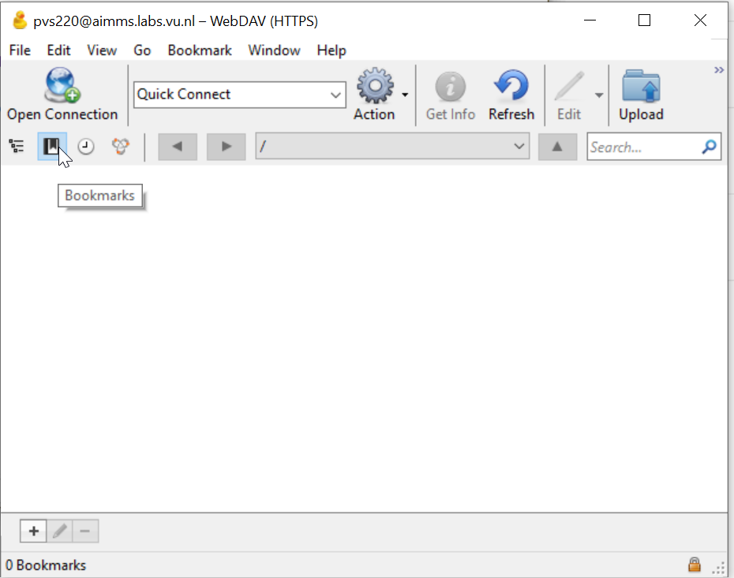
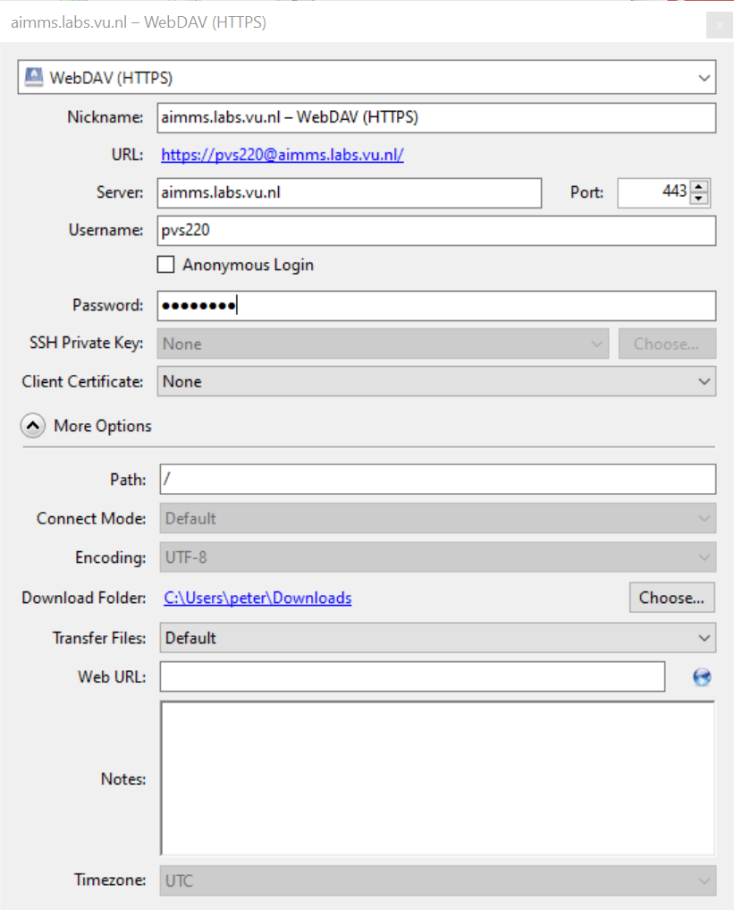
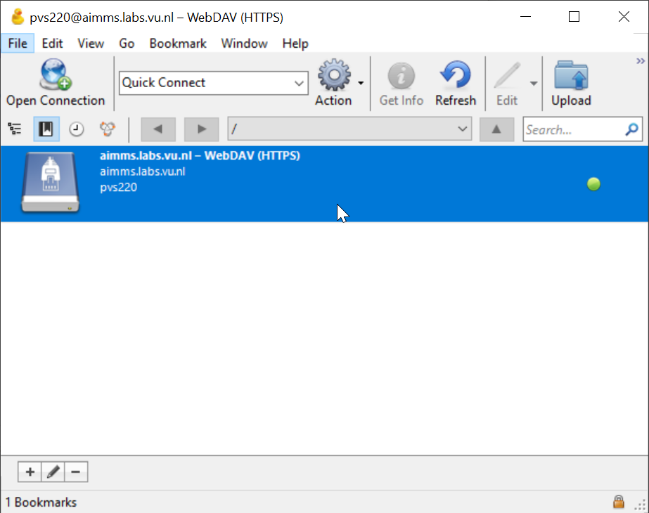
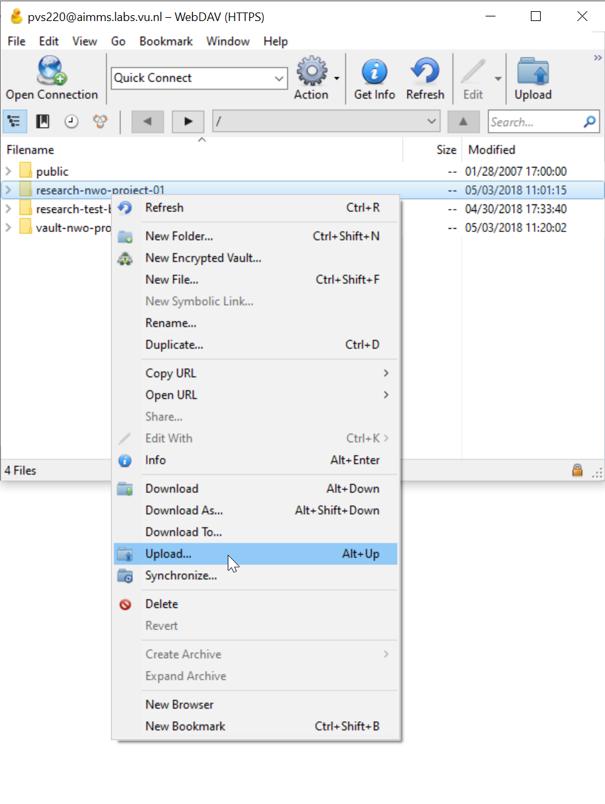

# Connecting to the Yoda Network Disk on Windows Using WinSCP

Windows and Mac users can use [Cyberduck](https://cyberduck.io/) to access their data via the Yoda Network Disk,
as an alternative to the [native WebDAV client](yoda-disk-windowsnative.md) and
[YodaDrive](yoda-disk-yodadrive.md). Cyberduck like WinSCP is an application for working with remote data,
whereas WebDrive and YodaDrive map the Yoda Network Disk to a drive transparently. So you can
use the WebDrive and YodaDrive to work with data in Yoda as if it was local data, but if you use
Cyberduck you may have to copy your data to a local disk or network drive before being able to work with it,
depending on the use case and application.

Windows users can download and install Cyberduck from the [website](https://cyberduck.io/download/). Mac users can install CyberDuck from the VU Software Center. 

## Using Cyberduck

Start Cyberduck from the Desktop icon or the Start menu.

In the initial Window click on the bookmarks icon and then click on the + at the bottom of the window.

Enter the server address of your environment (see table below) in the Host name field. The port number should have its default value: 443.

Enter the Username and Password (either vunetid or an emailaddress).

| Environment          | Address | Login                  |
|:-------------------- |:------------|:-------------------------|
| AIMMS pilot | https://aimms.labs.vu.nl/ | vunetid | 
| Surf Pre-production | https://data.yoda.vu.nl/ | email and password |

Close the window and you should see a new bookmark.

Doubleclick the bookmark. Cyberduck should now open your Yoda Network Disk.

Down- or upload files by right-clicking on a folder and using the menu. You can also drag and drop files and folders via the Windows Explorer/MacOS Finder.
