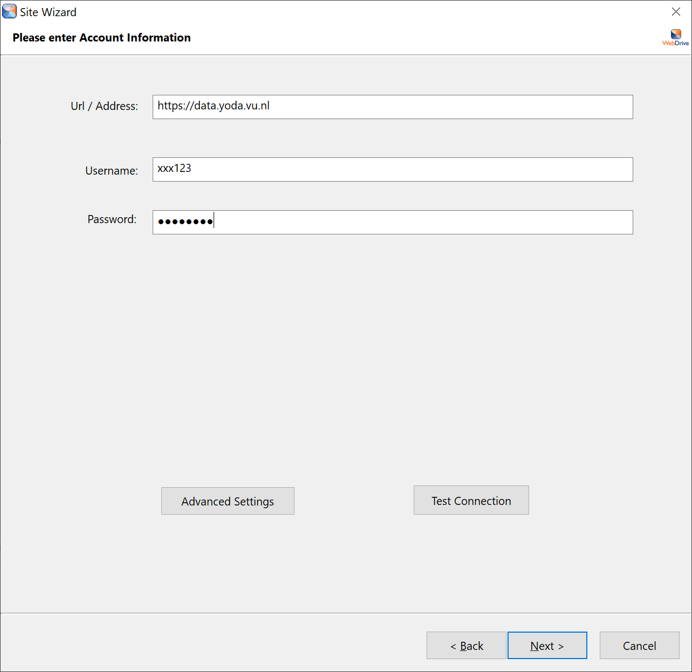
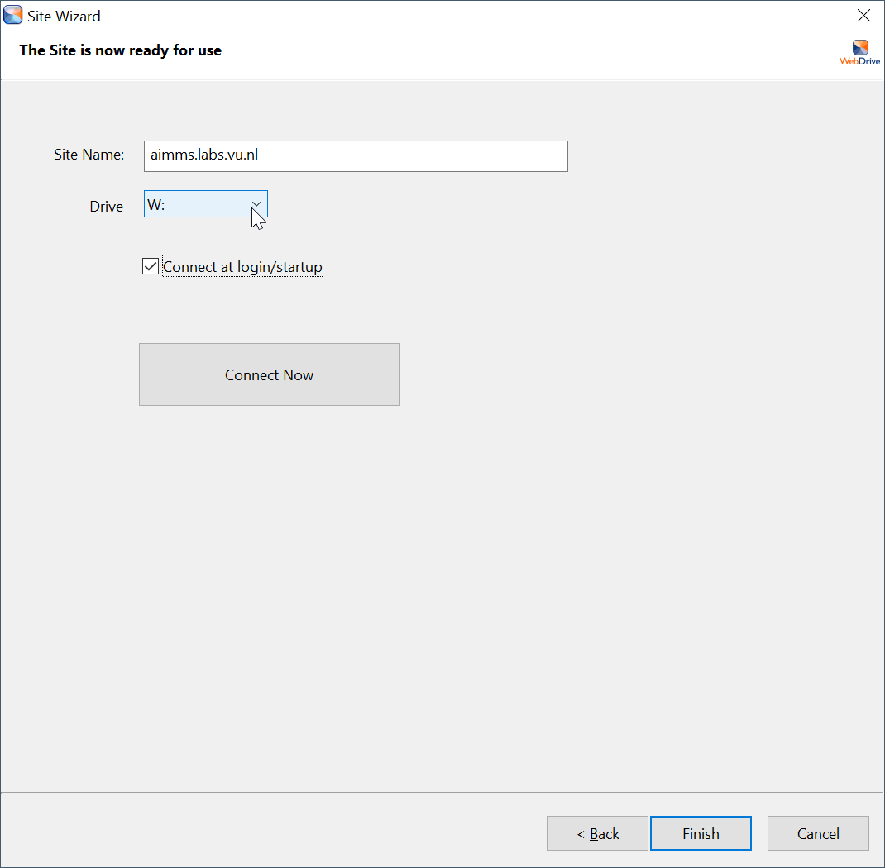
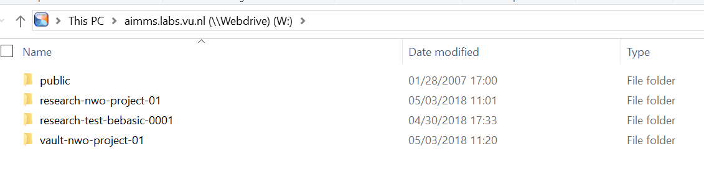

# Connecting to the Yoda Network Disk on Windows Using WebDrive

Windows users can use [WebDrive](https://webdrive.com/) to access their data via the Yoda Network Disk,
as an alternative to the [native WebDAV client](yoda-disk-windowsnative.md) and
[YodaDrive](yoda-disk-yodadrive.md). With WebDrive the Yoda Network Disk can be connected via as a drive in 
Windows Explorer. 

As a VU user you can download a licensed version of WebDrive from [download.vu.nl](https://download.vu.nl).
 

## Using WebDrive

Start Webdrive from the Desktop icon or the Start menu.

In the initial Window click new.

Choose Secure WebDAV and click Next.

Enter the server address of your environment (see table below) in the Url/Address field.

Enter the Username and Password (either vunetid or an emailaddress). You can click Test Connection to see if the 
credentials are correct. 

| Environment          | Address | Login                  |
|:-------------------- |:------------|:-------------------------|
| AIMMS pilot | https://aimms.labs.vu.nl/ | vunetid | 
| Surf Yoda pilots | https://vu-data.irodspoc-sara.surf-hosted.nl/ | email and password |

Click Next

Choose a Drive letter and Connect Now. 

You should now see the Yoda Disk in your Windows Explorer.