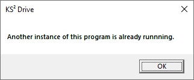

# Troubleshooting YodaDrive issues

This page contains information about how to troubleshoot issues that occur when installing or using
[YodaDrive](yoda-disk-yodadrive.md).

## Installation fails with an error message about missing files

This can happen if you don't extract the YodaDrive zip file before starting the installation.

Please extract the YodaDrive archive by right-clicking on it and choosing &ldquo;Extract all&rdquo;

")

The click on the &ldquo;Extract&rdquo; button and proceed with the installation.

")

## Installation fails with an error message about a failed download

This can happen if the automatic download of WinFSP fails.

Install WinFSP by downloading [the MSI file](https://github.com/billziss-gh/winfsp/releases/download/v1.5B2/winfsp-1.5.19192.msi) and
running it. Then run the YodaDrive installer (&ldquo;Setup&rdquo;) again.

## Clicking on the YodaDrive icon results in an error message

If you get an error message which states that YodaDrive is already running, such as the one in the
picture below, you can open the YodaDrive management window via the YodaDrive icon in the system tray.

By default, the system tray can be found in the bottom right corner of your screen, next to the clock.

If you don't see the YodaDrive icon, expand the system tray using the &ldquo;^&rdquo; button in the system tray,
and check whether you see the YodaDrive icon in the expanded tray.

Open the YodaDrive configuration by clicking on the system tray icon and choosing &ldquo;Manage&rdquo;.

You should now see a management
window. If you don’t see it, minimize your other open application windows to see if the YodaDrive window is behind it.

## Nothing happens after clicking on the Manage button

Pressing the &ldquo;Manage&rdquo; button will open the YodaDrive management window.

If nothing seems to happen when you press this button, it's possible that the YodaDrive window
is already open, but obscured by another window. Try to minimize the other application
windows in this case.

## The Yoda Network Disk disappears

This can happen if you have changed your password, but the YodaDrive configuration still has the old password.
You can fix this by [updating the password in the YodaDrive configuration](yoda-disk-yodadrive-update-passwd.md).
