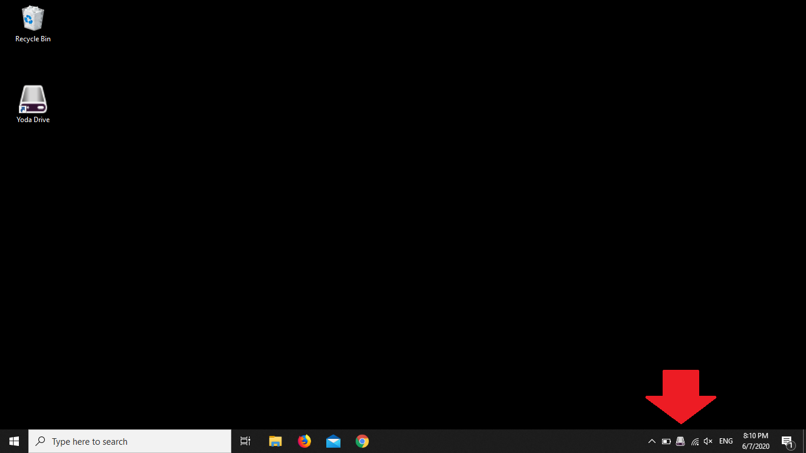
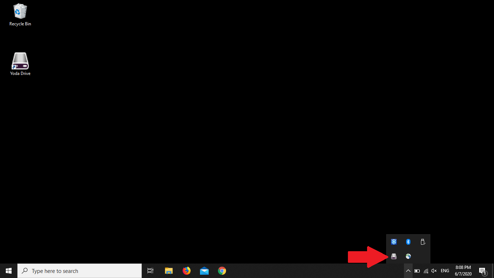
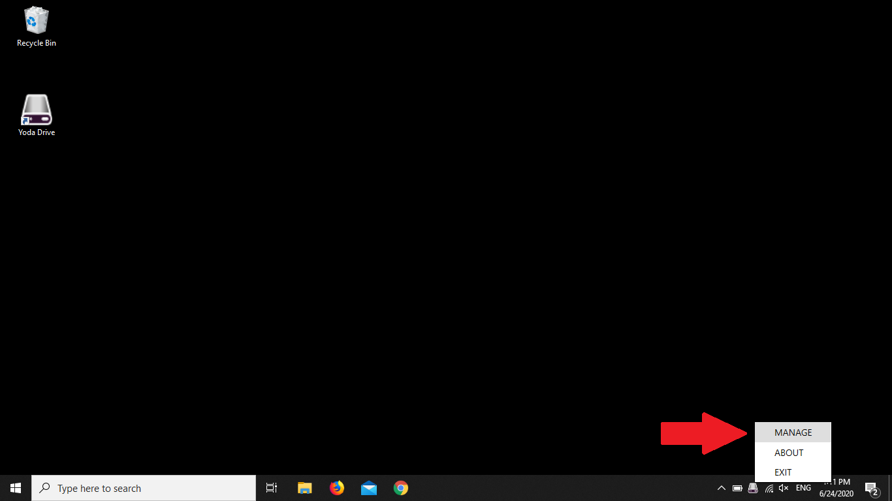
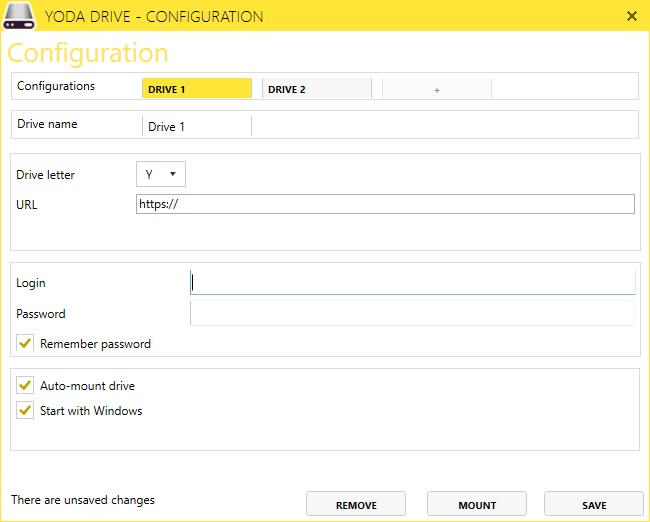

# Updating your password in YodaDrive

If you have changed your password, you will also need to update your password in YodaDrive.

Open the YodaDrive management window via the system tray.
By default, the system tray can be found in the bottom right corner of your screen, next to the clock.

If you don't see it, expand the system tray using the &ldquo;^&rdquo; button, and check whether you see the YodaDrive icon in the expanded
tray.

Open the YodaDrive configuration by clicking on the system tray icon and choosing &ldquo;Manage&rdquo;.

You should now see a management
window. If you don’t see it, minimize your other open application windows to see if the YodaDrive window is behind it.

If the drive is still mounted, click on the &ldquo;Unmount&rdquo; button. Change the password in the password field
and save the configuration using the &ldquo;Save&rdquo; button. Finally, click on the &ldquo;Mount&rdquo; button to mount (connect to)
the Yoda Network Disk.

