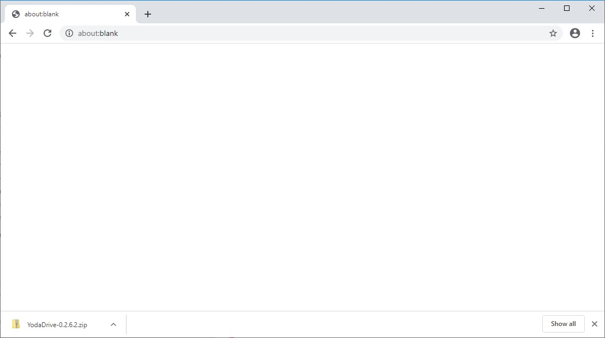
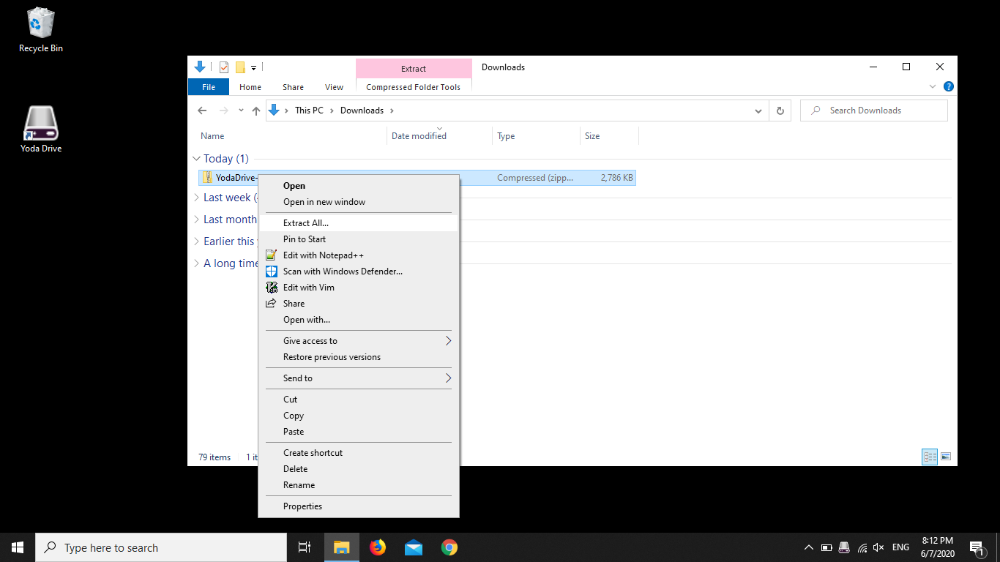
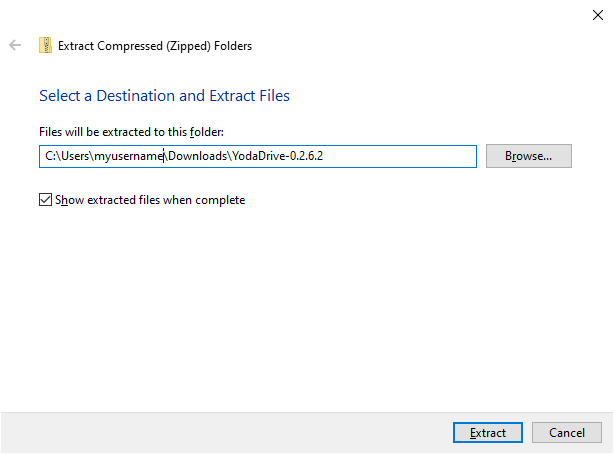
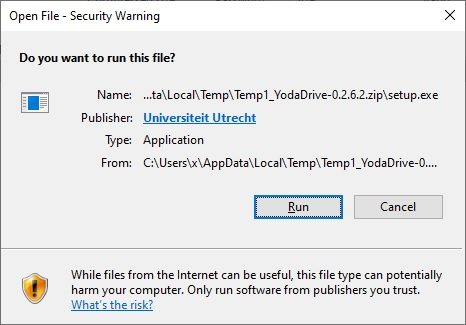
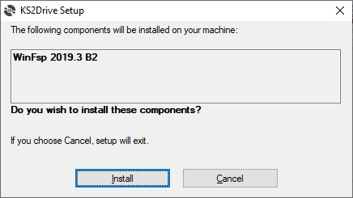
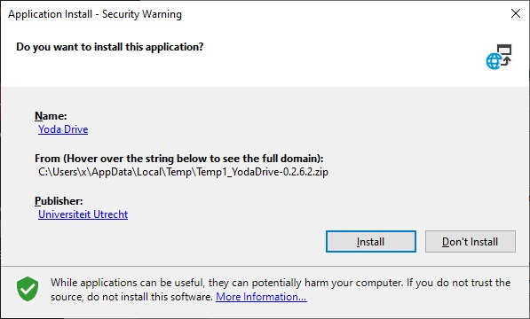

# Connecting to the Yoda Network Disk using YodaDrive

This page explains how to connect to the Yoda Network Disk from a Windows PC using YodaDrive

Generally speaking, YodaDrive is the recommended application for connecting to the Yoda Network Disk on a Windows system.
However, in some specific situations 
the [Windows native WebDAV client](yoda-disk-windowsnative.md) is a better alternative: 
- If you need to be able to connect to multiple Yoda environments simultaneously.
- If you can't install YodaDrive, for example if the security settings of your laptop
  prevent you from installing any new applications.
- YodaDrive is intended for use with Windows 10. If you use Windows 7 and are unable to upgrade,
  you can still use the native WebDAV client to connect to the Yoda Network Disk as a temporary workaround.

## Installing YodaDrive

Download the YodaDrive installation bundle by clicking on this link:
[https://github.com/UtrechtUniversity/YodaDrive/releases/download/0.2.6.2/YodaDrive-0.2.6.2.zip](https://github.com/UtrechtUniversity/YodaDrive/releases/download/0.2.6.2/YodaDrive-0.2.6.2.zip). 

Navigate to your Downloads folder and right click on the YodaDrive zip file. Choose &ldquo;Extract all&rdquo;.

A window for extracting the zip file is opened. Click on the &ldquo;Extract&rdquo; button in the lower right corner of the window.

Double click on &ldquo;setup&rdquo; and confirm that you want to run it.

Confirm that you want to install WinFSP. If an additional dialog is shown about whether you want to make a change to your computer, confirm it.

Confirm that you want to install YodaDrive.

Wait until the installation is complete. You should have a new shortcut on your desktop, as well as an icon in your system tray.
By default, the system tray icon is shown in the lower right corner of the screen, to the left of the clock.

If you don't see it, expand the system tray using the &ldquo;^&rdquo; button, and check whether you see the YodaDrive icon in the expanded
tray.

Open the YodaDrive configuration by clicking on the system tray icon and choosing &ldquo;Manage&rdquo;.  You should now see a management
window. If you don’t see it, minimize your other open application windows to see if the YodaDrive window is behind it.

Select a drive letter &mdash; any free letter is okay. Now enter the server address of the environment in the URL field (see table below).

| Environment          | Address | Remarks                  |
|:-------------------- |:------------|:-------------------------|
| AIMMS pilot | https://aimms.labs.vu.nl/ | |
| Surf Pre-production | https://data.yoda.vu.nl/ | |

 
Enter your user name in the &ldquo;Login&rdquo; field and your password in the &ldquo;Password&rdquo; field.
If you are an employee or student at Utrecht University, your user name is your Utrecht University email address (in lowercase) and your password
is your Solis password. External users have usually received their user name via email, along with a link to set their password.

If you are working on your personal PC or laptop, tick the checkbox &ldquo;Remember Password&rdquo;. If you are working on a shared computer, it is
better not to tick this checkbox for security reasons. Tick the checkboxes &ldquo;Auto-mount drive&rdquo; and &ldquo;Start with Windows&rdquo;.

Click &ldquo;Save&rdquo; and then &ldquo;Mount&rdquo;.

You can now view the Yoda Network Disk in Explorer.

If you run into any problems, please consult the [page about troubleshooting YodaDrive issues](yoda-disk-yodadrive-tshoot.md).
